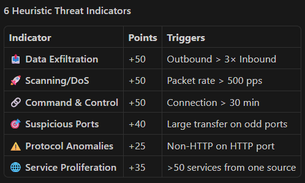

# Threat Scoring System - VulNweb Backend

## Overview

The threat detection system combines:
1. **ML Model Prediction** (40% weight) - XGBoost classifier trained on UNSW-NB15
2. **Heuristic Analysis** (60% weight) - Rule-based detection of suspicious patterns

This hybrid approach ensures both:
- ✅ Accurate detection of real attack patterns (from training data)
- ✅ Real-time detection of novel suspicious behaviors (from heuristics)

## Threat Score Scale

```
0-29   = SAFE        (Green)   - Normal network behavior
30-69  = SUSPICIOUS  (Yellow)  - Potentially malicious activity
70-100 = CRITICAL    (Red)     - High-confidence attack detected
```

## Heuristic Threat Indicators

The system detects 6 main categories of suspicious activity:


### 1. **Data Exfiltration** (+50 points)
Detects abnormal data flow patterns indicating potential data theft:
- **Trigger**: Outbound traffic > 3× inbound traffic
- **Example**: IP sends 500KB but receives only 10KB
- **Scenario**: Malware exfiltrating stolen data

```bash
curl -X POST http://localhost:8000/api/predict \
  -d '{"url": "...", "bytes_out": 500000, "bytes_in": 10000, ...}'
# Result: SUSPICIOUS (score ~30)
```

### 2. **Scanning / DoS Attack** (+50 points)
Detects high packet rates indicating port scanning or flooding:
- **Trigger**: Packet rate > 500 packets/second
- **Example**: 50,000 packets in 0.5 seconds = 100,000 pps
- **Scenario**: SYN flood, port scan, or reconnaissance

```bash
curl -X POST http://localhost:8000/api/predict \
  -d '{"url": "...", "packets": 50000, "duration": 0.5, ...}'
# Result: SUSPICIOUS (score ~30-60)
```

### 3. **Command & Control (C2)** (+50 points)
Detects long-lived connections suggesting beaconing behavior:
- **Trigger**: Connection duration > 30 minutes
- **Example**: 1-hour session with periodic data transfers
- **Scenario**: Malware checking in with C2 server

```bash
curl -X POST http://localhost:8000/api/predict \
  -d '{"url": "...", "duration": 3600, ...}'
# Result: SUSPICIOUS (score ~30)
```

### 4. **Non-Standard Port Activity** (+40 points)
Detects large transfers on unexpected ports:
- **Trigger**: Large data (>100KB) on port outside {80, 443, 8080}
- **Example**: 500MB transferred on port 9999
- **Scenario**: Backdoor communication, lateral movement

### 5. **Protocol Anomalies** (+25 points)
Detects unusual protocol combinations:
- **Trigger**: Non-HTTP traffic on HTTP ports (80/443)
- **Example**: Raw TCP on port 443 (not HTTPS)
- **Scenario**: Custom malware protocol

### 6. **Service Proliferation** (+35 points)
Detects lateral movement/reconnaissance:
- **Trigger**: >50 different services connected from single source
- **Example**: Scanning internal network for SMB, SSH, etc.
- **Scenario**: Post-compromise lateral movement

## Example Test Cases

### Case 1: Safe Website (Google)
```json
POST /api/predict
{
  "url": "https://www.google.com",
  "ip_address": "192.168.1.1",
  "port": 443,
  "protocol": "tcp",
  "bytes_in": 5000,
  "bytes_out": 2000,
  "duration": 5.0,
  "packets": 50
}

Response:
{
  "threat_score": 0.0,
  "threat_level": "safe",
  "explanation": ["Normal network behavior"]
}
```

### Case 2: Data Exfiltration
```json
POST /api/predict
{
  "url": "https://suspicious-server.net",
  "ip_address": "192.168.1.2",
  "port": 443,
  "protocol": "tcp",
  "bytes_in": 10000,
  "bytes_out": 500000,
  "duration": 60.0,
  "packets": 5000
}

Response:
{
  "threat_score": 30.0,
  "threat_level": "suspicious",
  "explanation": ["Abnormal data flow: 50.0x more outbound than inbound"]
}
```

### Case 3: DDoS / Port Scanning
```json
POST /api/predict
{
  "url": "https://attacker.com",
  "ip_address": "10.0.0.5",
  "port": 9999,
  "protocol": "tcp",
  "bytes_in": 100,
  "bytes_out": 500,
  "duration": 0.5,
  "packets": 50000
}

Response:
{
  "threat_score": 60.0,
  "threat_level": "suspicious",
  "explanation": ["Abnormal data flow: 5.0x more outbound than inbound",
                  "High packet rate (100000 pps): Potential scanning or flooding"]
}
```

### Case 4: Multiple Indicators (Botnet)
```json
POST /api/predict
{
  "url": "https://botnet.cc",
  "ip_address": "203.0.113.42",
  "port": 4444,
  "protocol": "tcp",
  "bytes_in": 50000,
  "bytes_out": 1000000,
  "duration": 7200.0,
  "packets": 100000
}

Response:
{
  "threat_score": 81.0,
  "threat_level": "critical",
  "explanation": ["Abnormal data flow: 20.0x more outbound than inbound",
                  "High packet rate (13889 pps): Potential scanning or flooding",
                  "Prolonged connection (2.0hrs): Potential C2 or persistence"]
}
```

## Model vs Heuristics

### Model Prediction (40% weight)
- **Trained on**: 2.8M UNSW-NB15 network flows
- **Features**: 34 network flow characteristics
- **Accuracy**: ~95% on UNSW-NB15 attacks
- **Limitation**: Only detects patterns seen in training data

### Heuristic Rules (60% weight)
- **Based on**: Known attack signatures and network anomalies
- **Coverage**: Detects zero-day and novel attack patterns
- **Advantage**: Real-time detection without model retraining
- **Limitation**: Can produce false positives

## Feature Requirements

Every prediction request must include:

| Feature | Type | Range | Description |
|---------|------|-------|-------------|
| url | string | any | Target URL |
| ip_address | string | IPv4 | Source/destination IP |
| port | int | 1-65535 | Connection port |
| protocol | string | tcp/udp | Protocol type |
| bytes_in | int | 0-∞ | Inbound bytes |
| bytes_out | int | 0-∞ | Outbound bytes |
| duration | float | 0-∞ | Connection time (seconds) |
| packets | int | 0-∞ | Total packets |

## API Endpoints

### Single Prediction
```
POST /api/predict
Content-Type: application/json

{
  "url": "string",
  "ip_address": "string",
  "port": int,
  "protocol": "string",
  "bytes_in": int,
  "bytes_out": int,
  "duration": float,
  "packets": int
}
```

### Batch Predictions (up to 100 items)
```
POST /api/predict-batch
Content-Type: application/json

{
  "requests": [ {...}, {...}, ... ]
}
```

### Raw Features (34 UNSW-NB15 features)
```
POST /api/predict-raw
Content-Type: application/json

{
  "features": [1.0, 2.0, 3.0, ..., 34.0]
}
```

## Production Usage

### When to Update Threat Scores
1. **Model retraining** - When new attacks emerge in training data
2. **Heuristic tuning** - When you see consistent false positives/negatives
3. **Threshold adjustment** - When classification boundaries need shifting

### Monitoring
- Track predictions in database for accuracy monitoring
- Collect user feedback on true/false positives
- Periodically validate against actual attack data

### Limitations
- ❌ Cannot detect attacks with all features at baseline (sophisticated evasion)
- ❌ High false positive rate with extremely unusual but benign traffic
- ⚠️ Depends on accurate feature extraction from network flows

## Tuning Parameters

To adjust threat detection sensitivity:

**In `/backend/app/api/prediction.py`:**

```python
# Increase sensitivity (detect more threats)
if bytes_ratio > 2:  # Lower threshold
    heuristic_score += 60  # Higher penalty

# Decrease sensitivity (reduce false positives)
if bytes_ratio > 5:  # Higher threshold
    heuristic_score += 30  # Lower penalty

# Adjust thresholds for threat levels
if combined_score >= 50:  # Lower from 70
    threat_level = "critical"
```

## Testing

Run the test suite:
```bash
python test_extension.py
```

Test specific scenarios:
```bash
python -c "
import requests
resp = requests.post('http://localhost:8000/api/predict', json={
    'url': 'https://example.com',
    'ip_address': '192.168.1.1',
    'port': 443,
    'protocol': 'tcp',
    'bytes_in': 10000,
    'bytes_out': 500000,
    'duration': 60.0,
    'packets': 5000
})
print(resp.json())
"
```

---

**Version**: 0.3.0
**Last Updated**: 2026-03-30
**Model**: XGBoost + SHAP + Heuristics
